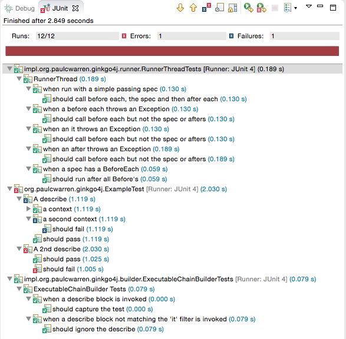
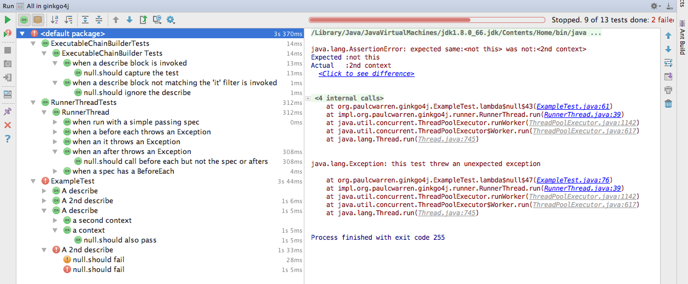

# Ginkgo4j
##A Java BDD Testing Framework  (based on RSpec and [ginkgo](http://onsi.github.io/ginkgo/))
[](https://travis-ci.org/paulcwarren/ginkgo4j)

Jump to the the [docs](https://paulcwarren.github.com/ginkgo4j) to see more.

Feature List:-
- Structure your BDD-style tests expressively:
  - Nestable Describe and Context container blocks
  - BeforeEach and AfterEach blocks for setup and teardown
  - It blocks that hold your assertions
  - JustBeforeEach blocks that separate creation from configuration (also known as the subject action pattern).
- Fast testing with parallel execution

- Test runners that lets you:
  - Focus tests through FDescribe, FContext and FIt constructs
  - Test your Spring applications  

## Requires
- Java 8

## Getting Started
- Add the ginkgo4j to your project as a test dependency.  For a maven project add:-

```
<dependency>
    <groupId>com.github.paulcwarren</groupId>
    <artifactId>ginkgo4j</artifactId>
    <version>1.0.7</version>
    <scope>test</scope>
</dependency>
```
or for a Gradle project add:-
`compile 'com.github.paulcwarren:ginkgo4j:1.0.7'`

for other build systems see [here](http://search.maven.org/#artifactdetails%7Ccom.github.paulcwarren%7Cginkgo4j%7C1.0.7%7Cjar).

- Create a junit test class
  - Add the following imports:-
```
import static com.github.paulcwarren.ginkgo4j.Ginkgo4jDSL.*;
import com.github.paulcwarren.ginkgo4j.Ginkgo4jRunner;
```
  - Annotate your test class with:-
```
@RunWith(Ginkgo4jRunner.class)
```
  - And the following template:-
```
	{
		Describe("Replace me", () -> {
			It("Replace me too", () -> {
				fail("Not yet implemented");
			});
		});
	}
``` 
   - Optionally, you can control the number of threads used with `@Ginkgo4jConfiguration(threads = 1)`

### Getting Started with Spring
   - Add the following imports:-
```
import static com.github.paulcwarren.ginkgo4j.Ginkgo4jDSL.*;
import com.github.paulcwarren.ginkgo4j.Ginkgo4jSpringRunner;
```
   - Annotate your test class with:-
```
@RunWith(Ginkgo4jSpringRunner.class)
```
   - Add the following template:-
```
	{
		Describe("Replace me", () -> {
			It("Replace me too", () -> {
				fail("Not yet implemented");
			});
		});
	}
	@Test
	public void noop() {
	}
```

## Screenshots
### Eclipse


### Intellij

