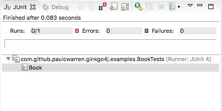

# Ginkgo4j
## A Java BDD Testing Framework

[Ginkgo4j](https://github.com/paulcwarren/ginkgo4j) is a BDD-style Java testing framework built to help you efficiently write expressive and comprehensive tests.

Ginkgo4j was inspired by its namesake [Ginkgo](https://onsi.github.io/ginkgo).  It mirrors frameworks from other languages like RSpec in Ruby.  All of these framework provide a very simply DSL that the developer can use in his test to build up a described context with closures.  

Since version 8 Java has included it’s version of closures, called Lambda’s.  Whilst there aren’t quite as flexible as some of their equivalents on other languages.  All variable access must be to ‘finals’ for example.  They are sufficient to build an equivalent  testing DSL.  That’s what we decided to do with Ginkgo4j, pronounced Ginkgo for Java.

## Getting Ginkgo4j

Add the ginkgo4j to your project as a test dependency.  For a maven project add:-

```
<dependency>
    <groupId>com.github.paulcwarren</groupId>
    <artifactId>ginkgo4j</artifactId>
    <version>1.0.9</version>
</dependency>
```
or for a Gradle project add:-

`compile 'com.github.paulcwarren:ginkgo4j:1.0.9'`

for other buold systems see [here](http://search.maven.org/#artifactdetails%7Ccom.github.paulcwarren%7Cginkgo4j%7C1.0.0%7Cjar).

## Getting Started: Writing Your First Test
### Bootstrapping a Test
In your Java 8 project, add a new test class called BookTests.java as follows:-

```java
package com.github.paulcwarren.ginkgo4j.examples;

import static com.github.paulcwarren.ginkgo4j.Ginkgo4jDSL.*;
import static org.hamcrest.CoreMatchers.is;
import static org.hamcrest.MatcherAssert.assertThat;

import org.junit.runner.RunWith;

import com.github.paulcwarren.ginkgo4j.Ginkgo4jRunner;

@RunWith(Ginkgo4jRunner.class)
public class BookTests {
	{
		Describe("Book", () -> {
		});
	}
}

```
Let’s break this down:

- The imports *Ginkgo4jDSL.** and *Ginkgo4jRunner* add Ginkgo4j’s DSL and JUnit runner to this class.  The JUnit runner allows these style of tests to be run in all IDEs supporting JUnit and also in build tools such as Ant, Maven and Gradle.
- The hamcrest imports add Hamcrest's matcher library that we will use to make assertions in our test. 
- We add a top-level *Describe* container using Ginkgo4j’s `Describe(String title, ExecutableBlock block)` method.  The top-level braces `{}` trick allows us to evaluate the *Describe* at the top level without having to wrap it.  The 2nd argument to the *Describe* `() -> {}` is a lambda expression defining an anonymous class that implements the ExecutableBlock interface.  This lamdba expression will contain our specs.  

At this point you can run you suite.  In eclipse we right-click on or test class and select `Run As...->Junit test`.


### Adding Specs

An empty test is not very interesting so let’s add some Specs our Book class.

```
private Book longBook;
private Book shortBook;
{
 Describe("Book", () -> {
   BeforeEach(() -> {
     longBook = new Book("Les Miserables", "Victor Hugo", 1488);
     shortBook = new Book("Fox In Socks", "Dr. Seuss", 24);
   });

   Context("Categorizing book length", () -> {
     Context("With more than 300 pages", () -> {
       It("should be a novel", () -> {
         assertThat(longBook.categoryByLength(), is("NOVEL"));
       });
     });

     Context("With fewer than 300 pages", () -> {
       It("should be a short story", () -> {
         assertThat(shortBook.categoryByLength(), is("NOVELLA"));
       });
     });
   });
   });
 }
```

Let’s break this down:

- Ginkgo4J makes extensive use of lambdas to allow you to build descriptive test suites.
- You should make use of *Describe* and *Context* containers to expressively organize the behavior of your code.
- You can use *BeforeEach* to set up state for your specs. You use *It* to specify a single spec.
- In order to share state between a *BeforeEach* and an *It* you must use member variables.
- We use Hamcrest’s assertThat syntax to make expectations on the categoryByLength() method.
Assuming a Book model with this behavior, running this JUnit test in Eclipse (or Intellij) will yield:


Success!

## Focussed Specs

It is often convenient, when developing to be able to run a subset of specs. Ginkgo4J allows you to focus individual specs or whole containers of specs programatically by adding an F in front of your *Describe*, *Context*, and *It*:

```
 FDescribe("some behavior", () -> { ... })
 FContext("some scenario", () -> { ... })
 FIt("some assertion", () -> { ... })
```

doing so instructs Ginkgo4J to only run those specs. To run all specs, you’ll need to go back and remove all the Fs.

## Parallel Specs

Ginkgo4J has support for running specs in parallel.  It does this by spawning separate threads and dividing the specs evenly among these threads.  Parallelism is on by default and will use 4 threads.  If you wish to modify this you can add the additional annotation to your test class:-

```
@Ginkgo4jConfiguration(threads=1)
```
which will instruct Ginkgo4J to run a single thread.

## Spring Support

Ginkgo4J also offers native support for Spring.  To test a Spring application context simply replace the `@RunWith(Ginkgo4jRunner.class)` with `@RunWith(Ginkgo4jSpringRunner.class)` and initialize you test class’ Spring application context in exactly the same way as if you were using Spring’s SpringJUnit4ClassRunner

```
@RunWith(Ginkgo4jSpringRunner.class)
@SpringApplicationConfiguration(classes = Ginkgo4jSpringApplication.class)

public class Ginkgo4jSpringApplicationTests {
  @Autowired
  HelloService helloService;
  {
  Describe("Spring intergation", () -> {
    It("should be able to use spring beans", () -> {
      assertThat(helloService, is(not(nullValue())));
    });

    Context("hello service", () -> {
      It("should say hello", () -> {
        assertThat(helloService.sayHello("World"), is("Hello World!"));
      });
    });
   });
   }

   @Test
   public void noop() {
   }
 }
```

The `noop` test class is currently required as Spring’s JUnit runner requires on at least one method annotated with `@Test`.
